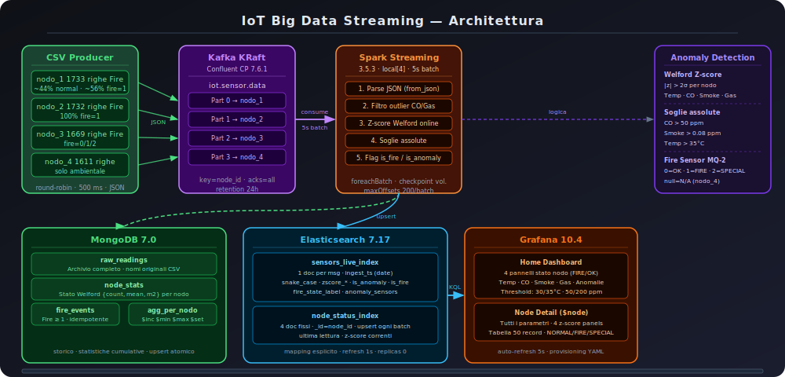

# IoT Streaming Pipeline — Real-time Fire & Anomaly Detection

> 4 sensor nodes · Kafka · Spark Structured Streaming · Elasticsearch · MongoDB · Grafana

A fully containerised streaming pipeline that ingests environmental sensor data from 4 independent IoT nodes, processes it in real-time with anomaly detection and fire-transition logic, and visualises everything on live Grafana dashboards refreshed every 5 seconds.

Built as a university project for the Big Data course (Master's degree), the system intentionally simulates a **multi-machine deployment**: each sensor node runs in its own container, Spark runs as a Standalone cluster (1 master + 3 workers), and every service communicates via explicit hostnames as it would on separate physical hosts.

---

## Architecture

```
[machine-1]  csv-producer-1 (nodo_1) ──┐
[machine-2]  csv-producer-2 (nodo_2) ──┤──► Kafka  ──► Spark Standalone Cluster
[machine-3]  csv-producer-3 (nodo_3) ──┤   4 parts        │
[machine-4]  csv-producer-4 (nodo_4) ──┘                  ▼
                                               ┌───────────┴────────────┐
                                          MongoDB                 Elasticsearch
                                        5 collections              2 indices
                                               └───────────┬────────────┘
                                                           ▼
                                                        Grafana
```



---

## Tech Stack

| Component | Technology | Version |
|---|---|---|
| Message broker | Confluent Kafka (KRaft, no ZooKeeper) | 7.6.1 |
| Stream processing | Apache Spark Structured Streaming | 3.5.3 |
| Time-series store | Elasticsearch | 7.17.28 |
| Document store | MongoDB | 7.0 |
| Dashboards | Grafana | 10.4.2 |
| Producer | Python + kafka-python | 3.11 |
| Platform | Docker Compose · ARM64 (Apple Silicon) | — |

---

## What the pipeline does

Each sensor node continuously streams CSV rows to a dedicated Kafka partition. Spark consumes them in micro-batches every 5 seconds and runs the full enrichment pipeline before writing to multiple sinks:

```
CSV Producer ×4
    │  JSON messages (key = node_id, explicit partition 0–3)
    ▼
Kafka  iot.sensor.data  (4 partitions · 24h retention)
    │  micro-batch every 5s · max 200 offsets/partition
    ▼
Spark Structured Streaming — foreachBatch
    │
    ├─ 1. Write raw JSON → MongoDB  raw_readings         (immutable history)
    │
    │  ── cleaning ──────────────────────────────────────────────────────────
    │  Filter outliers: CO > 1000 ppm or Gas > 1 MΩ  →  discarded
    │
    │  ── enrichment ─────────────────────────────────────────────────────────
    │  Welford online z-score (Temperature, CO, Smoke, Gas)
    │  Absolute thresholds: CO > 50 ppm · Smoke > 0.08 · Temp > 35 °C
    │  Fire transition: flag raised only when Fire crosses 0 → ≥1
    │
    ├─ 2. Write enriched rows → MongoDB  processed_readings
    ├─ 3. Bulk index  → Elasticsearch  sensors_live_index  (time-series)
    ├─ 4. Upsert      → Elasticsearch  node_status_index   (1 doc/node, live status)
    ├─ 5. Write       → MongoDB  fire_events               (transition events only)
    └─ 6. Upsert      → MongoDB  agg_per_nodo              (rolling stats)
```

### Anomaly detection

Two complementary mechanisms run in parallel:

- **Welford online z-score** — mean and variance updated incrementally without storing history. State `{count, mean, m2}` is persisted in MongoDB `node_stats` and survives container restarts. An anomaly is flagged when `z > 2σ` on any of the four sensors.
- **Absolute thresholds** — CO > 50 ppm, Smoke > 0.08 ppm, Temperature > 35 °C. These cover the Welford warm-up period and nodes with a structurally elevated baseline.

### Fire transition logic

A `fire_event` is recorded **only when a node transitions from no-fire (Fire = 0) to fire (Fire ≥ 1)**, not on every row where Fire ≥ 1. This avoids flooding the collection with noise from nodes that are permanently near fire. The previous fire value (`last_fire_value`) is persisted in MongoDB `node_stats` per node.

### Lambda Architecture

| Layer | Sink | Content |
|---|---|---|
| Batch — raw | `raw_readings` | Every message before any filtering |
| Batch — processed | `processed_readings` | Post-filter with z-scores and anomaly flags |
| Serving — time-series | `sensors_live_index` | Grafana time-series queries |
| Serving — live status | `node_status_index` | Current snapshot per node (Fire / NO FIRE cards) |

---

## Repository structure

```
.
├── docker-compose.yml          # Full orchestration (14 services)
├── .env.example                # Environment variable template
├── csv_producer/
│   ├── csv_producer.py         # Parametric producer (NODE_ID + CSV_PATH)
│   ├── Dockerfile
│   └── requirements.txt
├── spark_job/
│   ├── spark_stream_job.py     # Full pipeline (~520 lines)
│   ├── entrypoint.sh           # Dispatches SPARK_ROLE: master | worker | driver
│   ├── submit.sh               # spark-submit to standalone cluster
│   ├── Dockerfile
│   └── requirements.txt
├── mongo_init/
│   └── init.js                 # Creates collections and indexes on first run
├── grafana/
│   └── provisioning/           # Dashboards and datasources provisioned from files
├── architettura.svg
└── RELAZIONE_TECNICA.md
```

> **Not included in the repo** (must be provided manually):
> - `.env` — generate from `.env.example`
> - `acquisizioni/` — CSV files from physical sensors

---

## Prerequisites

- **Docker Desktop** running (Apple Silicon M1/M2)
- **8 GB** allocated to the Docker VM (system uses ~6.4 GB)
- Sensor CSV files placed in `acquisizioni/` (see structure below)

---

## Quick start

### 1. Clone

```bash
git clone https://github.com/AleFlu/Big_Data_iot.git
cd Big_Data_iot
```

### 2. Create `.env`

```bash
cp .env.example .env
```

Generate a Kafka KRaft cluster ID and paste it in:

```bash
docker run --rm confluentinc/cp-kafka:7.6.1 kafka-storage random-uuid
```

```
# .env
CLUSTER_ID=<generated-uuid>
PRODUCER_DELAY_MS=500
ES_HEAP_SIZE=512m
MONGO_INITDB_DATABASE=sensor_data
```

### 3. Place the sensor CSV files

```
acquisizioni/
├── Nodo_1/prima_acquisizione/nodo1_csv.csv   # 1 733 rows · includes Fire column
├── Nodo_2/prima_acquisizione/nodo2.csv       # 1 732 rows · includes Fire column
├── Nodo_3/prima_acq/nodo3_csv.csv            # 1 669 rows · includes Fire column
└── Nodo_4/nodo4_csv.csv                      # 1 611 rows · no Fire column
```

Columns: `Temperature (C)` · `Humidity (%)` · `Pressure (hPA)` · `Gas (Ohm)` · `Visible Light` · `IR` · `UV index` · `CO` · `NO2` · `Smoke (ppm)` · `Fire` (optional)

### 4. Start everything

```bash
docker compose up -d
```

Wait ~60–90 seconds for all health checks to pass, then open Grafana:

```
http://localhost:3000   (admin / admin)
```

<details>
<summary>Step-by-step startup (first time or after issues)</summary>

```bash
# Build custom images
docker compose build

# Core infrastructure
docker compose up -d kafka mongodb elasticsearch

# Create Kafka topic (wait ~30–60s for kafka to be healthy)
docker compose up kafka-init

# Spark cluster
docker compose up -d spark-master
# Check: http://localhost:8082 → Spark Master UI
docker compose up -d spark-worker-1 spark-worker-2 spark-worker-3
# Check: http://localhost:8082 → 3 Workers

# Spark streaming job
docker compose up -d spark-job
docker compose logs -f spark-job
# Wait for: "Streaming query avviata"

# CSV producers
docker compose up -d csv-producer-1 csv-producer-2 csv-producer-3 csv-producer-4

# Monitoring tools
docker compose up -d grafana mongo-express kafka-ui
```

</details>

---

## Services & ports

| Service | URL | Credentials |
|---|---|---|
| **Grafana** | http://localhost:3000 | admin / admin |
| Spark Master UI | http://localhost:8082 | — |
| Kafka UI | http://localhost:8080 | — |
| Mongo Express | http://localhost:8081 | — |
| Elasticsearch | http://localhost:9200 | — |
| MongoDB | localhost:27017 | — |
| Kafka | localhost:9092 | — |

---

## Grafana dashboards

Two dashboards are provisioned automatically:

**IoT Sensor Dashboard** (home) — global view across all 4 nodes:
- Fire / NO FIRE live status cards (one per node)
- Temperature, CO, Smoke time-series per node
- Anomaly count, fire activity over time, latest anomaly events

**IoT Node Detail** — drill-down for a single node:
- All sensors overlaid on a single time axis
- Z-score trend, anomaly timeline, rolling stats

---

## Spark cluster roles

The same Docker image handles all Spark roles, selected via `SPARK_ROLE`:

| Container | SPARK_ROLE | Role |
|---|---|---|
| `spark-master` | master | Coordinator — accepts jobs, assigns tasks |
| `spark-worker-1/2/3` | worker | Executor — 1 core · 512 MB each |
| `spark-job` | driver | Submits the job, runs `foreachBatch` Python logic |

The driver runs in **client mode**: `foreachBatch` logic executes in the `spark-job` container; workers handle only the Spark DataFrame parsing and filtering tasks assigned by the master.

---

## Memory requirements

| Service | mem_limit |
|---|---|
| Elasticsearch | 1 024 MB |
| Spark workers × 3 | 640 MB × 3 |
| Spark driver | 768 MB |
| Spark master | 512 MB |
| Kafka | 512 MB |
| MongoDB | 512 MB |
| CSV producers × 4 | 128 MB × 4 |
| Grafana + tools | ~640 MB |
| **Total** | **~6.4 GB** |

Set at least **8 GB** in Docker Desktop → Settings → Resources → Memory.

---

## Full reset

```bash
# Stop everything and wipe all volumes (ES, MongoDB, Kafka, Spark checkpoints)
docker compose down -v

# Rebuild from scratch
docker compose build --no-cache
docker compose up -d
```
